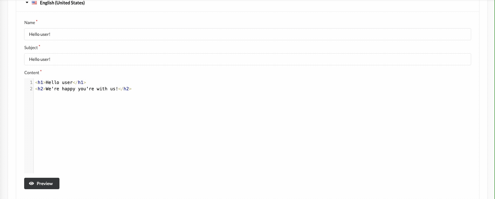

# Functionalities

---
## Introduction

---
This plugin allows you to edit email templates from the admin panel using all twig features.
It is possible to customise the different look of the email depending on the language selected.
## Usage

I support changing the template for the following email types:
- Admin Password Reset
- Order Confirmation
- User Registration
- Shipment Confirmation
- Shipment Confirmation Resent
- Password Reset
- Account Verification Token
- Account Verification
- Order Confirmation Resent
- Reset Password Token
- Reset Password Pin
- Verification Token

---
### Email templates list
Mail template plugin config page:

    

 

Adding new email template:

    

 

Preview of the designed template:

    

 
