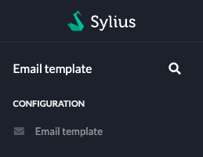
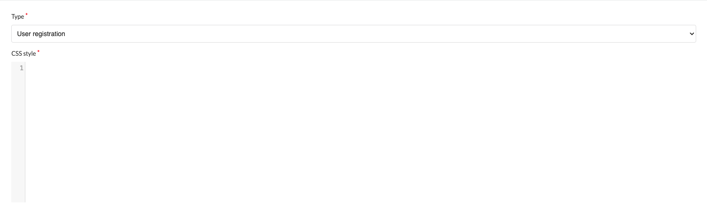
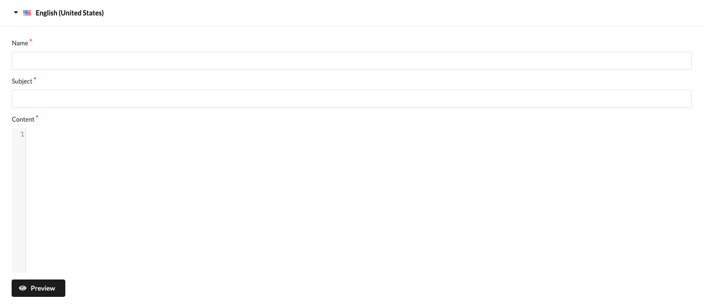
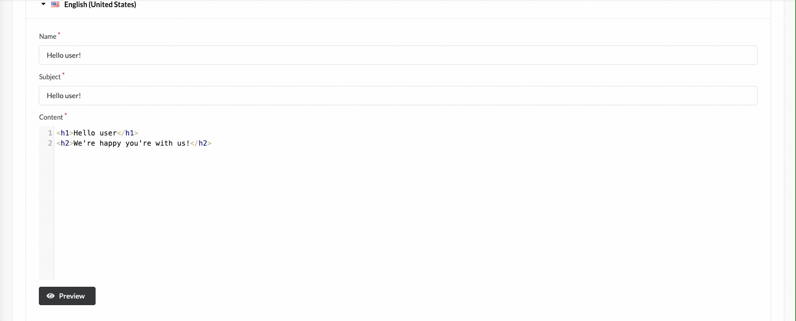

# BitBag SyliusMailTemplatePlugin

## Usage

---

Before sending an email there's a check if for the given locale and email type exists custom email template. If it exists, it will be used instead of the default one.

### Creating a new mail template
You can manage your templates by accessing `Email templates` from the sidebar in Admin Panel.

#### Step 1 - Create custom email template
First step is to select a type of email and add custom css styles.

#### Step 2 - define an email
The next step is to define an email’s name, subject and content for every language we want to support.

#### Step 3 - (optional) preview your work
Any time you can preview your email by clicking Preview button. Remember that preview feature does not reflect in 100% what your client would see. Every email client may render the content in a little different way.

Summary
Overriding defaults email templates using Sylius MailTemplate plugin is a simple process. Admin Panel user in a few clicks can replace any email template without overriding twig files, configuring sylius_mailer or accessing neither ftp nor ssh.
